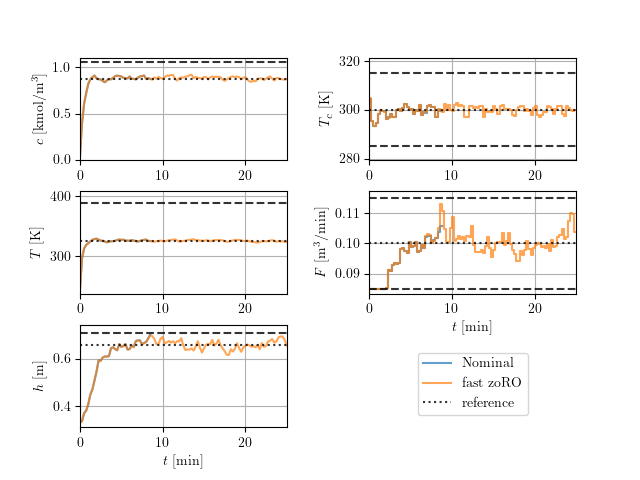

# zoRO example using custom templates
TODO: write short generic test, and how to run examples.
remove figures.


## Differential Drive Robot
Run tests:
```python ./diff_drive/main.py```

Timings of solving one OCP with fast zoRO (BLASFEO) ($\mathrm{max\_iter} = 2$):


Timings of solving one OCP with zoRO (numpy) ($\mathrm{max\_iter} = 2$):


## Continuous Stirred-tank Reactor (CSTR)

State and input trajectory ($\mathrm{max\_iter} = 1$):


Nominal:
 min: 1.079 ms, mean: 1.937 ms, max: 5.451 ms

fast zoRO:
 min: 1.328 ms, mean: 2.333 ms, max: 4.767 ms