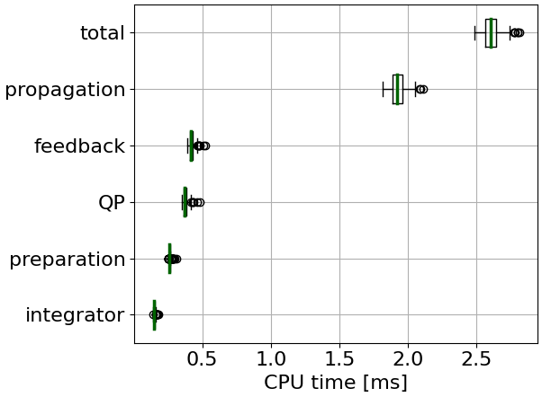
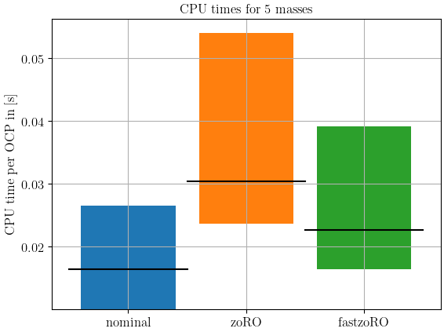
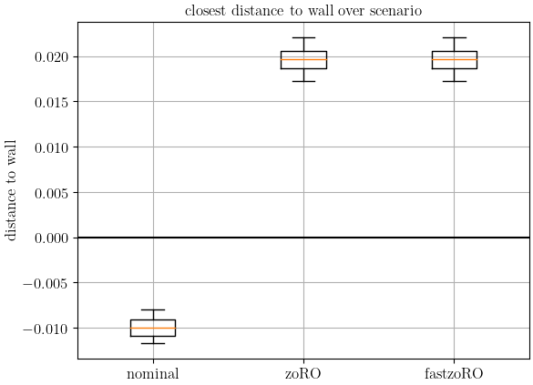

## Differential Drive Robot
Run tests:
```python ./diff_drive/main.py```

Timings of solving one OCP with fast zoRO (BLASFEO) when $\mathrm{max\_iter} = 2$:


Timings of solving one OCP with zoRO (numpy) when $\mathrm{max\_iter} = 2$:


## Hanging Chain

Run tests:
```python ./zoro-NMPC-2021/main.py```

CPU time per OCP when $n_\mathrm{mass} = 5$ and $\mathrm{max\_iter} = 50$:


Closest distance to the wall:



## Continuous Stirred-tank Reactor (CSTR)